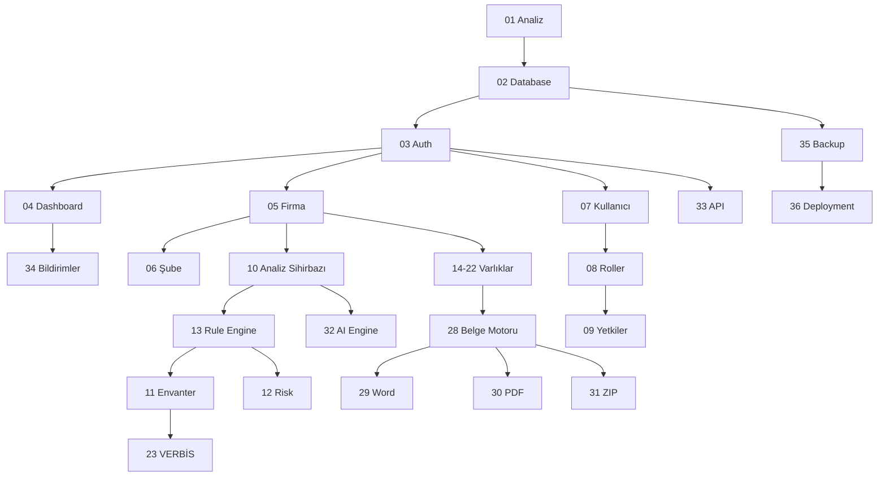

# Yol Haritası ve Modül Bağımlılıkları

## Faz Durumu Kaynağı

Canlı takip: [`docs/PHASE_STATUS.md`](../PHASE_STATUS.md)

## Bağımlılık Diyagramı (özet)

## Sprint Tanımı

Her faz sprint’i şunları içerir (uygunsa):

Analiz → Kod → Migration → Seeder → Model → Controller → Service → Repository → View → Routes → Policy → Request → Test → README → CHANGELOG
